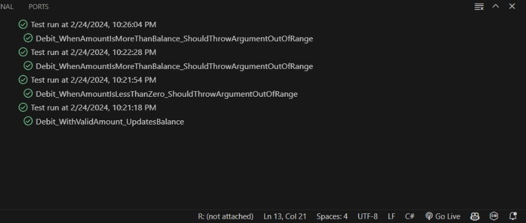

# M09-SEM3-PROG

#### Pergunta
Realize o passo a passo do artigo e armazene o seu código em um repositório git. Crie um relatório em markdown com um resumo explicando a tecnologia, os conceitos aprendidos. Adicione prints com o código em execução.

#### TECNOLOGIAS
- Ambiente de desenvolvimento: Vscode
- Linguagem: C#
- Framework: .NET

#### Aprendizado

Nesta atividade aprendi na prática sobre testes de unidade em C# utilizando o Visual Studio. Os testes de unidade são uma parte fundamental do desenvolvimento de software, pois ajudam a garantir a qualidade do código, identificando erros e problemas de lógica antes mesmo da integração com o restante do sistema. 

- Conceitos aprendidos:
1- Criação de Projetos de Teste: Aprendi a criar um projeto de teste de unidade no Visual Studio.

2- Estrutura de Testes de Unidade: Compreendi a estrutura básica de um projeto de teste de unidade, incluindo a criação de classes de teste, métodos de teste e a organização dos testes em suites.

3- Execução de Testes: Pratiquei a executar os testes de unidade no Visual Studio, seja individualmente, em grupos ou todos de uma vez. Isso nos permite verificar se nossos métodos estão funcionando corretamente e se nenhum erro foi introduzido durante o desenvolvimento.

#### Prints

